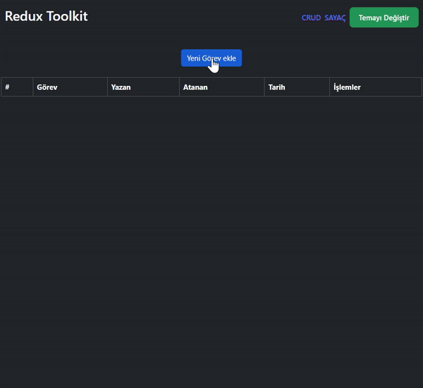

<h1>Redux Toolkit </h1>

Bu proje Redux Toolkit kullanarak basit bir CRUD (Create, Read, Update, Delete) uygulaması ile bir sayaç uygulamasını içerir. CRUD uygulaması görevleri yönetmeyi sağlarken, sayaç uygulaması ise basit artırma ve azaltma işlemlerini gerçekleştirir. 

<h2> Proje Amacı </h2>

<ul>

<li> Yaratıcı ve Eğitici Bir Deneyim Sunma:

<ul>
<li>Redux Toolkit, Redux'in karmaşıklığını azaltarak daha hızlı ve verimli bir şekilde durum yönetimi sağlar.</li>

</ul>
</li>
</ul>

<ul>
<li> Teknoloji Staklarının Uygulanmasını Gösterme:
<ul>
<li>Proje, modern web geliştirme teknolojilerinin bir kombinasyonunu içerir.</li>
<li>React, Redux Toolkit, React Router, Bootstrap gibi popüler kütüphaneler ve araçlar bir araya getirilerek nasıl kullanılacağı gösterilmektedir.</li>
<li> Ayrıca, bu teknolojilerin bir arada nasıl çalışacağına dair bir model sunarak, geliştiricilere yol göstermeyi amaçlamaktadır.</li>

</ul>
</li>

<ul>
<li>Yenilikçi Fikirlerin Denenmesi ve Uygulanması:
<ul>
<li>Proje, sadece temel CRUD ve sayaç işlevselliğini içermekle kalmaz, aynı zamanda yenilikçi fikirlerin de denenmesine olanak tanır. Örneğin, temayı değiştirme özelliği gibi ek işlevselliğin nasıl eklenip yönetileceğini gösterir. Böylece, geliştiricilerin sınırları zorlamasına ve yeni fikirleri denemelerine olanak sağlar.</li>

</ul>
</li>
</ul>

<h2> Projenin Yapısı </h2>
<ul>
<li><b>Header: </b>Başlık bileşeni, sayfa başlığını ve tema değiştirme işlevselliğini içerir.</li>
<li><b>Counter: </b>Sayaç bileşeni, artırma, azaltma ve sıfırlama işlemlerini gerçekleştirir.</li>
<li><b>CrudPage: </b>CRUD işlemlerini gerçekleştiren ana bileşen.</li>
<li><b>FormModal: </b>Görev ekleme ve düzenleme için modal bileşeni.</li>
<li><b>Redux Store: </b>CounterSlice ve crudSlice gibi dilimleri içerir. </li>
<li><b>React Router: </b>Sayfa yönlendirmeleri için React Router kullanılmıştır.</li>
</ul>

<h2> Kullanılan Teknolojiler </h2>

<ul>
<li>React</li>
<li>Redux Toolkit</li>
<li>React Router</li>
<li>Bootstrap (react-bootstrap)</li>
<li>Vite (Modern JavaScript aracı ve sunucusu)</li>
<li>UUID (Benzersiz kimlik oluşturma kütüphanesi)</li>
</ul>

<h2>Ekran Görüntüsü</h2>

